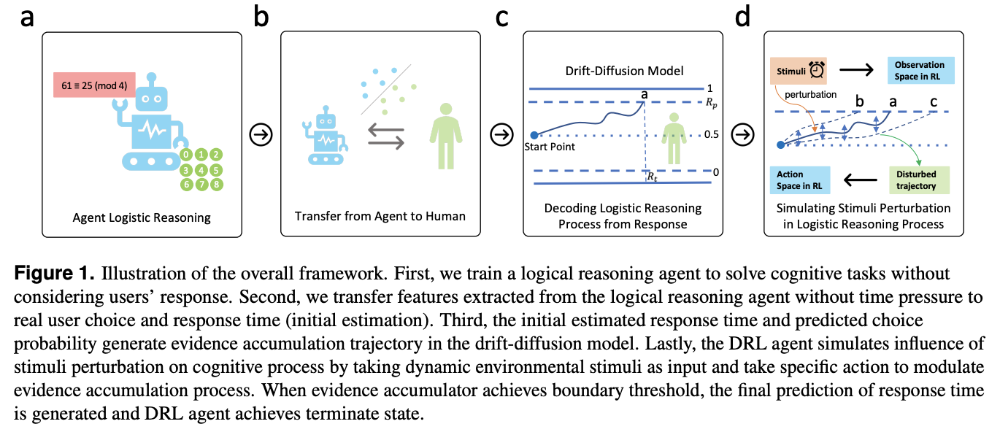

# CogReact: A Reinforced Framework to Model Human Cognitive Reaction Modulated by Dynamic Intervention



## Overview

This repo is composed of three parts:
- Part A. Run data collection study user interface (UI) in the math task (study_ui folder)
- Part B. Replicate drawing figures in the manuscript (paper_plot folder)
- Part C. Train models 

## Video dataset (optional)
This video dataset is not necessary to run our framework. But you can use it to build deep learning baselines which use video stimuli as input.

Download from google drive:
- Training video set: https://drive.google.com/file/d/14bCqTIiH-yDyJd31bW8DUwevaQmJATh9/view?usp=sharing
- Test video set: https://drive.google.com/file/d/1cVTgbfqYxyym9EzdjFQwp47L-tz7APUr/view?usp=sharing

## System requirements

- **Platform**: This repo has been tested in both Linux system (Nvidia RTX 2080 Ti and Nvidia RTX A6000) and MacOS (processor: 2.3 GHz 8-Core Intel Core i9, Memory: 16 GB 2667 MHz DDR4). 
- All the codes can directly run on MacOS or linux. However, if you want to train DRL model from beginning, we recommend you to use Nvidia GPU CUDA in Linux. Otherwise, the training process can be as long as several hours.
  - To run study UI, draw paper figures, or demo of small modelling training, you can just use MacOS or Linux.
  - To train DRL model from beginning, you should use Linux system with Nvidia GPU CUDA.


## Installation guide

We recommend to use python virtual environments venv to configure the environment. Here are the steps.

1. Install python 3.8 in your computer. We recommend using miniconda.
2. Make sure you have _**venv**_ to install virtual environments. If not, install it with pip.
3. Now let's create a virtual environment. Download and unzip this github repo. Make sure you are currently in the root folder using command: `cd folder name`. Then run command `python3.8 -m venv virtual_env`. This will create a folder named "virtual_env" which will contain all installed libraries. 
4. For MacOS/Linux, Run command `source virtual_env/bin/activate` to activate the virtual environment
5. We do NOT suggest you to directly install all libraries by command: "pip install -r requirements.txt". This may result in some incompatible issues among libraries. Instead, let's install each library step by step:
    - For Part A. Run data collection study user interface (UI) in the math task (**Make sure your numpy version is: numpy==1.23.1**), run `pip install pywebio==1.8.3` and `pip install numpy==1.23.1` 
    - For Part B. Replicate drawing figures in the manuscript, run `pip install scipy==1.10.1` and `pip install scikit-learn==1.3.2` and `pip install seaborn==0.13.2` and `pip install matplotlib==3.7.5` and `pip install stable-baselines3==1.5.0`. _**Make sure you install the same version: stable-baselines3==1.5.0**_.
    - For Part C for simulation model,
        - Install keras: run `pip install tensorflow==2.13.1` and it will automatically install both keras and tensorflow. If it fails, try `pip install tensorflow`. If you first install keras and then install tensorflow, you may encounter issues. Then you have to first uninstall both keras and tensorflow. After that, install tensorflow again, which also automatically installs keras. 
        - Install pydot and graphviz: `pip install pydot`, `pip install graphviz`
        - If you run DRL models, you also need to install `pip install opencv-python==4.9.0.80`

6. Be sure to check you have successfully installed all libraries before running codes.
7. Typical install time on a "normal" desktop computer with stable Internet connection: within 10 minutes. It may take longer time if your installation fails due to incompatible issues. In that case, try to uninstall packages and reinstall them by following the installation order above.

### In case of errors
- Check your package version
- If you encounter compatiable issues because of directly installing all packages, try to uninstall packages and follow the installation order to reinstall them.


## Instructions for the demo to run Part A: study user interface in the math task

1. Activate virtual environment as depicted before
2. Change your current folder to "study_ui" using command `cd study_ui`
3. Run `python main.py`
4. Expected output: The command terminal will show a link where you can click to open the study interface on your browser
5. Expected run time for demo on a "normal" desktop computer: within 12 seconds.

Note: 
1. You need to input valid user code in order to access the tasks. The user code and its group (feedback strategy) can be found in usercode_demo.json.
2. This is a demo user interface so we have changed the parameters such as trial number and rest duration so that you can experience and test it quickly. However, you can also change the study parameters from line 65 to line 71 in modular_math.py


## Instructions for Part B: replicate figures in the paper

Run `python figure_plot.py` to draw all figures after you have obtained the trained results. 

Later we will also release our trained models and weights so you can directly use our trained models to draw the figures.


## Instructions for the full training process in Part C 

For our simulation framework, there are three components: LSTM-based math logical reasoning agent, SVM model transfer, and DRL agents.

1. Run the first component: math logical reasoning agent training:     
    - activate virtual environment 
    - go to "math_answer_agent" folder by `cd math_answer_agent`
    - For demo, run `python lstm_math.py` directly to train 3 epochs.
    - Normal running time for demo in math agent is 260 seconds to train 3 epochs.
    - For full agent training, revise line 164 to be 100 epochs and run  `python lstm_math.py`.
    - For full training of 100 epochs, it may take additional 40 minutes.
2. Run the second component: transfer features from logical reasoning agents to humans' responses: 
    - activate virtual environment 
    - go to "svm_model" folder by `cd svm_model` if you are currently in the root folder
    - For demo, uncomment line 586 in main.py and run `python main.py` directly to train the user-level model.
    - Normal running time for demo in SVM transfer is 5 minutes for user-level model.
    - For full model training in all configurations, you need to uncomment all codes from line 586 to line 612 and run `python main.py`.
    - For full training in all configurations, it may take 57-95 minutes.
3. Run the third component: DDM + DRL agents: 
    - activate virtual environment 
    - go to "rl_model" folder by `cd rl_model` if you are currently in the root folder
    - `env_run.py` is used to run Hybrid DDM + DRL agents and `env_run_whole.py` is used to run pure DRL agents as our baseline. 
    - For demo, change the training step in line 289 in `env_run.py` to a smaller value such as 10 and run `python env_run.py -t test` directly to train the general-level model.
    - Normal running time for demo in smaller steps in DRL agent can be within 10 minutes. Pay attention to output in the terminal. It is normal if there is no output in the terminal after all steps because it needs some time to save the model. If you set the training step to be 10, usually the training will be finished within 10 minutes. After that, it will take additional tens of minutes to run the testing in the test set.
    - However, for full DRL training, such as 50000 steps, it may take several hours in MacOS. So we strongly recommend you to use CUDA and GPU in Linux if you want to fully train DRL models from beginning.
    - To train individual-level hybrid DRL agents, run `python env_run.py -t eu`. Other model configurations can be found from line 1121 to line 1164 in `env_run.py` and hyperparameter config with training/testing steps can be set from line 271 to line 296. Similarly, configurations for pure DRL agents can be found from line 709 to line 728 in `env_run_whole.py` and hyperparameter config with training/testing steps can be set from line 268 to line 294.
    - The trained and tested results will be stored into a new subfolder in "rl_model" folder.
  
## Related paper

https://arxiv.org/abs/2301.06216

## Cite us
```bibtex
@article{xu2023modeling,
  title={Modeling Human Cognition with a Hybrid Deep Reinforcement Learning Agent},
  author={Xu, Songlin and Zhang, Xinyu},
  journal={arXiv preprint arXiv:2301.06216},
  year={2023}
}
```
## License

This project is covered under the Apache 2.0 License.

## Contact

For any issues, feel free to contact: soxu@ucsd.edu
